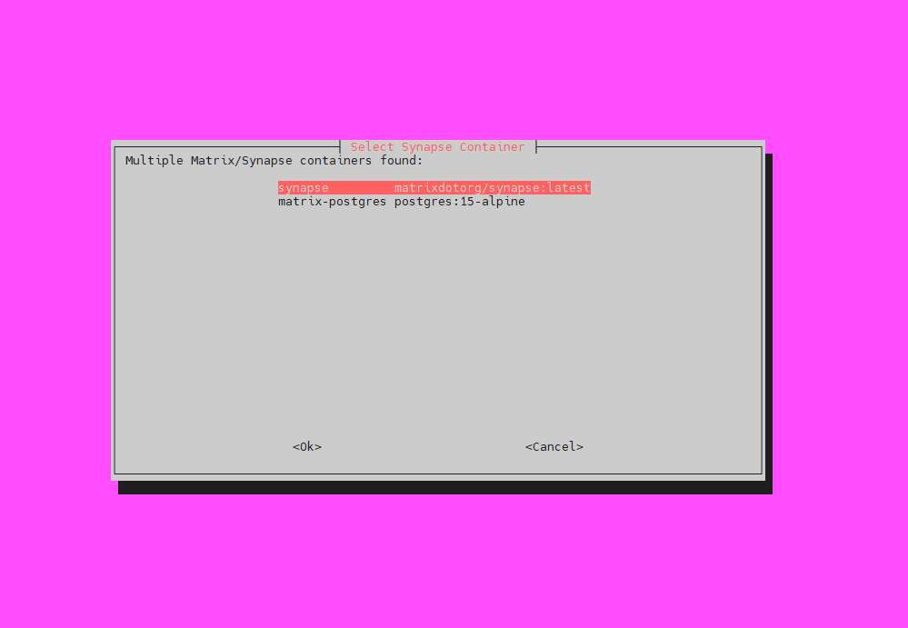

# Matrix User Manager 🛠️

> Interactive CLI tool for managing Matrix (Synapse) users inside Docker containers.  
> Built for reliability and real-world DevOps workflows.

[](#license)  
[](#features)

---

## Overview

**Matrix User Manager** is a Bash-based interactive utility that helps operators manage Synapse users without manually running SQL statements or entering containers. It supports both PostgreSQL and SQLite Synapse deployments, provides a `whiptail` TUI when available, and falls back to a friendly text UI otherwise.

This repo contains the script `matrix_user_manager.sh` and supporting docs.

---

## Features

- Auto-detect Synapse & Postgres containers (Docker)
- Support for **PostgreSQL** and **SQLite** Synapse installations
- List users, view details (devices, rooms), create users, reset passwords
- Deactivate / Reactivate (soft delete) users
- Backup DB (pg_dump or SQLite file copy)
- Run custom SQL queries
- Interactive UI using `whiptail` (with fallback text UI)
- Safe fallbacks and helpful error messages for common pitfalls

---

## Demo (whiptail)
Place a screenshot named `assets/whiptail-menu.png` (see **How to add the screenshot** below). Rendered here:



---

## Quick start

> Assumes you have `git`, `bash`, `docker` and access to the Synapse/Postgres containers.

```bash
# clone to your machine
git clone https://github.com/Ilia-shakeri/matrix_user_manager.git
cd matrix_user_manager

# make executable
chmod +x matrix_user_manager.sh

# run
./matrix_user_manager.sh
